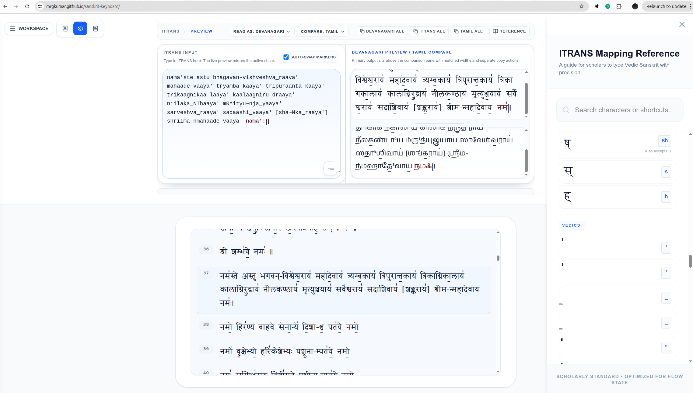

# Sanskrit Keyboard 🕉️



**Sanskrit Keyboard** is a transliteration workspace for scholarly Sanskrit and Vedic text entry. The main workflow is:

- type canonical or Baraha-compatible ITRANS
- see live output in Roman, Devanagari, or Tamil
- edit chunk-by-chunk for longer passages
- keep reference mappings and predictions close to the composer
- copy source or rendered output in several formats

Built with **Next.js 15**, **React 19**, and **Tailwind CSS 4**, it prioritizes low-friction typing and careful transliteration behavior for Vedic marks and precision rendering.

---

## 🚀 Try It Now

Experience the application live: **[https://mrgkumar.github.io/sanskrit-keyboard/](https://mrgkumar.github.io/sanskrit-keyboard/)**

---

## ✨ Key Features

- **🚀 Live Transliteration:** Real-time conversion from ITRANS to Devanagari, Roman, or Tamil.
- **🎼 Vedic Support:** Full support for Vedic accents (svaritas, anudattas) and rare marks (jihvamuliya, upadhmaniya).
- **🎭 Multi-Script Preview:** Side-by-side or stacked "Compare Mode" to view multiple scripts simultaneously.
- **🧠 Intelligent Predictions:** Context-aware word suggestions that learn from your typing patterns.
- **🛠️ Normalization & Cleanup:** Devanagari paste normalization and Tamil precision recovery for digitized text.
- **📜 Document Workspace:** Immersive read/edit split optimized for long-form passages and mantras.
- **📂 Session Persistence:** Automatic saving and management of your workspaces using `localStorage`.

---

## 🛠️ Tech Stack

- **Framework:** [Next.js 15](https://nextjs.org/) (App Router)
- **Library:** [React 19](https://react.dev/)
- **Styling:** [Tailwind CSS 4](https://tailwindcss.com/)
- **State Management:** [Zustand](https://zustand-demo.pmnd.rs/)
- **Persistence:** Browser `localStorage` for sessions and lexical learning
- **Testing:** [Playwright](https://playwright.dev/) (E2E) plus script-level audit checks

---

## 🚀 Getting Started

### Prerequisites

- Node.js (Latest LTS)
- npm or pnpm

### Installation

```bash
# Clone the repository
git clone https://github.com/mrgkumar/sanskrit_keyboard.git
cd sanskrit_keyboard/app

# Install dependencies
npm install
```

### Development

```bash
npm run dev
```

Open [http://localhost:3000](http://localhost:3000) to see the application in action.

---

## 🏗️ Architecture Overview

- **`src/app/`**: Next.js 15 routes and page layouts.
- **`src/components/`**: UI components organized by functional area (Engine, Audit, Reference, etc.).
- **`src/lib/vedic/`**: The core transliteration engine.
  - `mapping.ts`: The definitive scholarly mapping table (Source of Truth).
  - `utils.ts`: Transliteration logic and script normalization.
- **`src/store/`**: Global state management via Zustand (`useFlowStore`).
- **`docs/project-audit/`**: Source-backed audit notes, improvement opportunities, feature coverage, and backlog.

---

## 🧪 Testing

We take precision seriously. All changes to the engine or UI must be validated.

```bash
# Run targeted reverse-transliteration checks
npm run test-detransliterate

# Run the sampled reverse-transliteration check
npm run test-detransliterate-sampled

# Run the full browser regression suite
npx playwright test
```

---

## 🤝 Contributing

Contributions are welcome! Whether you're fixing a typo in the mapping, improving the UI, or adding support for a new script.

1.  **Fork the repo** and create your branch from `main`.
2.  **Check the mapping**: If you're adding characters, update `src/lib/vedic/mapping.ts`.
3.  **Run tests**: Use `npm run test-detransliterate`, `npm run test-detransliterate-sampled`, and relevant Playwright specs for UI work.
4.  **Style**: We use Tailwind CSS 4 and follow a clean, scholarly aesthetic.
5.  **Submit a PR**: Provide a clear description of your changes and any relevant screenshots.

---

## 📜 License

This project is open-source. Please check the LICENSE file in the root for details.

---

## 🙏 Credits

- Fonts provided by the [Siddhanta](http://www.sanskritweb.net/fonts/) and [Chandas](http://www.sanskritweb.net/fonts/) projects.
- Transliteration schemes based on the ITRANS standard.

---
*Built for the preservation and propagation of Sanskrit scholarship.*
